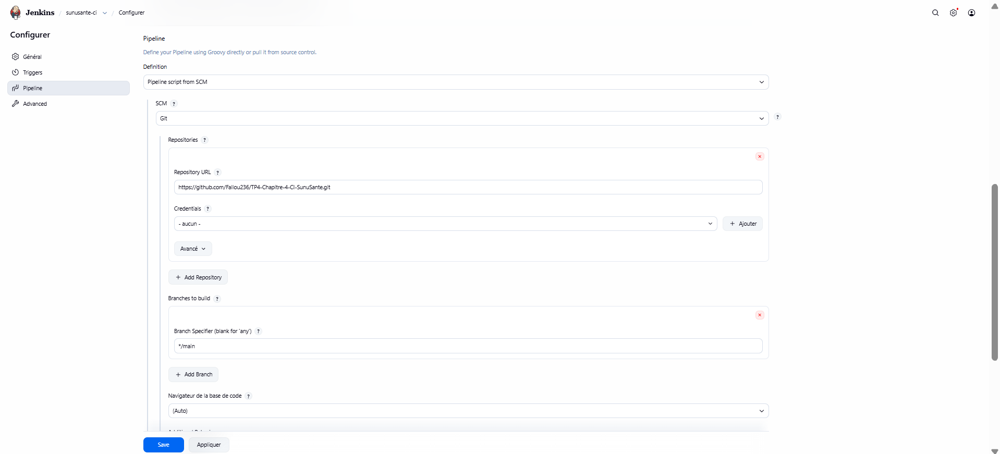
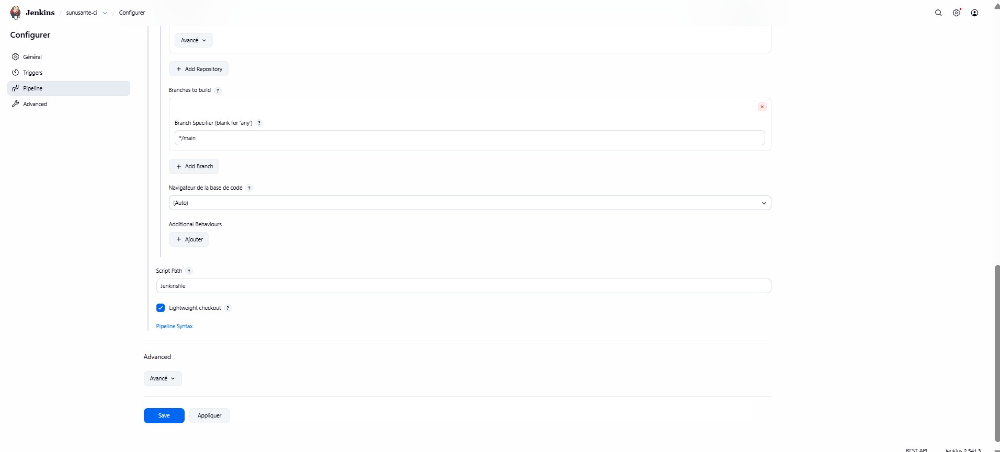
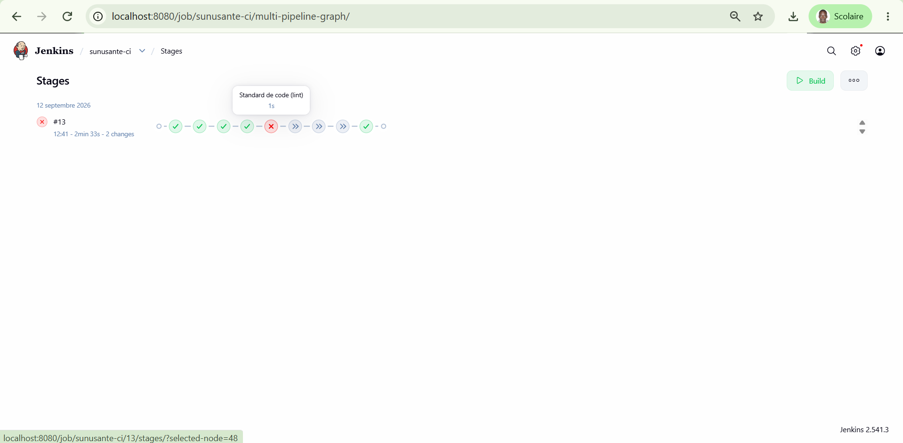
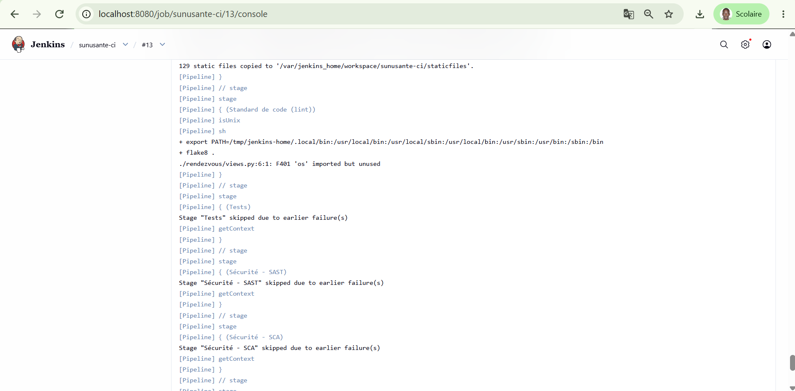
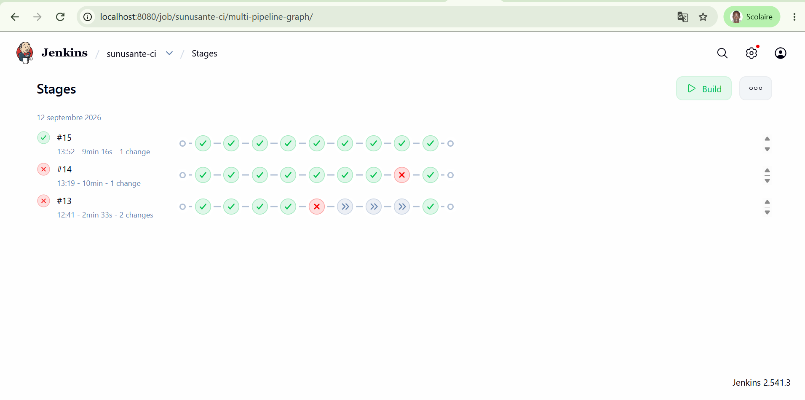
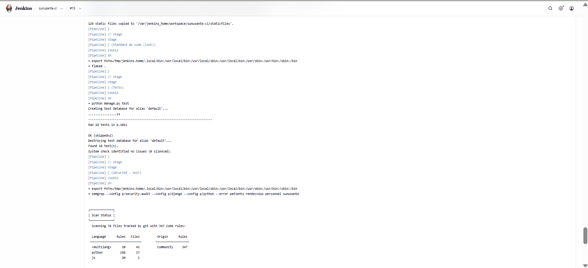
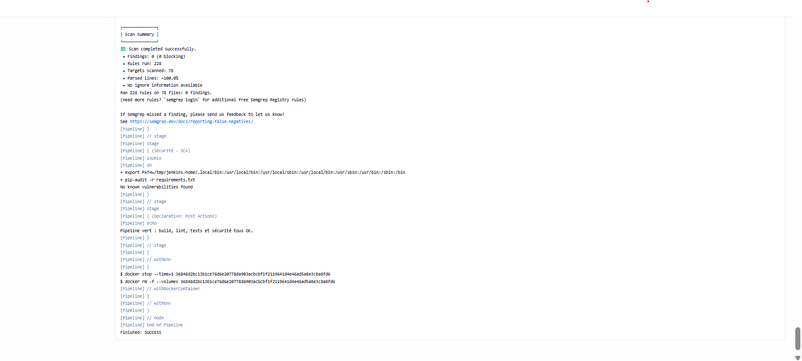
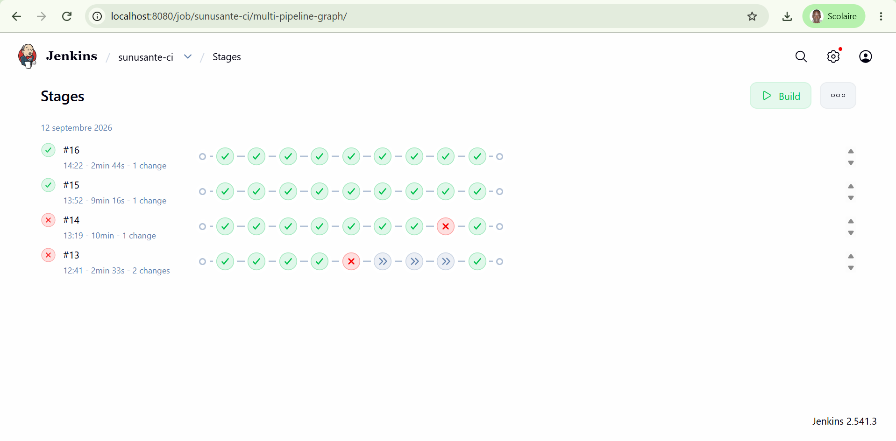
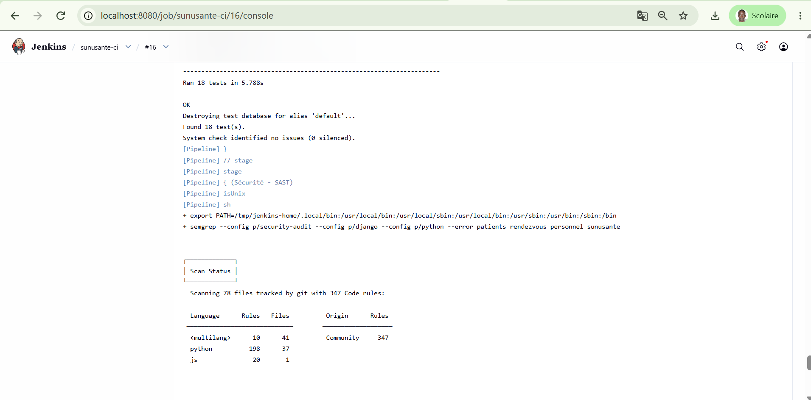
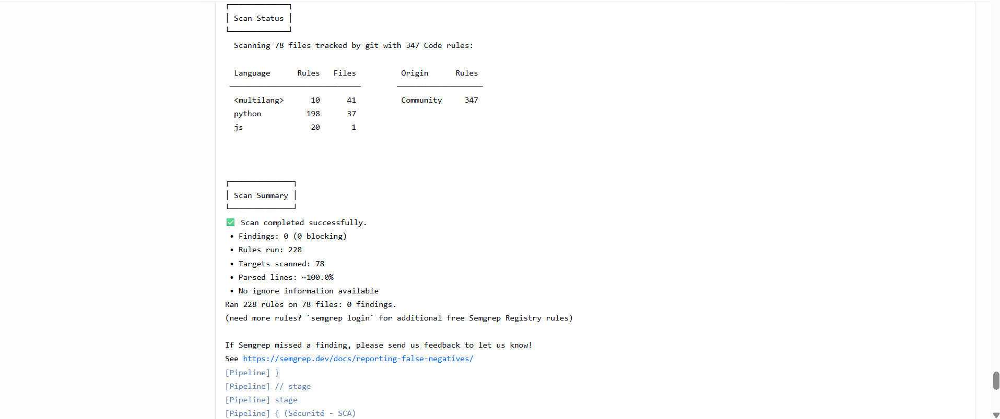

# Pipeline CI - SunuSanté

Nom / Groupe : Fallou DIOUCK et Abdoul DIOP

## 1. Le workflow d'intégration continue (chapitre 4, partie 1)

| Étape du cours | Stage Jenkins correspondant |
|---|---|
| 1. Commit & push | *(hors Jenkins)* commit local puis `git push` vers le dépôt GitHub `TP4-Chapitre-4-CI-SunuSante` |
| 2. Notification (Jenkins est prévenu) | Déclenchement du job `sunusante-ci` (voir ci-dessous) puis stage **Récupération du code** (`checkout scm`) |
| 3. Build | Stages **Installation des dépendances** et **Build** (`manage.py check`, `collectstatic --dry-run`) |
| 4. Feedback build | Un stage rouge arrête le pipeline ; le bloc `post { failure }` renvoie le message d'échec. Un stage vert enchaîne sur le suivant. |
| 5. Tests automatiques | Stage **Tests** (`manage.py test`), complété par les stages **Sécurité - SAST** (Semgrep) et **Sécurité - SCA** (pip-audit) |
| 6. Feedback tests | Bloc `post { success }` (« Pipeline vert : build, lint, tests et sécurité tous OK ») ou `post { failure }`, et la Stage View verte/rouge dans l'interface Jenkins |

**Comment Jenkins est-il informé qu'un nouveau commit existe ?**
Dans notre configuration, le déclenchement est **manuel** : après un `git push`,
on lance le build via le bouton **Build Now** de Jenkins. Jenkins récupère
alors la dernière révision de la branche `main` du dépôt GitHub
(`Pipeline script from SCM`). Une évolution naturelle serait un **webhook
GitHub** (déclenchement automatique à chaque push) ou du **polling SCM**
(Jenkins interroge le dépôt à intervalle régulier) ; le déclenchement manuel
suffit à l'échelle de ce TP.

## 2. Les prérequis d'une bonne CI (chapitre 4, partie 3)

| Prérequis | Statut sur SunuSanté | Détail |
|---|---|---|
| Dépôt avec versioning | **Respecté** | Git, dépôt distant **GitHub** (`Fallou236/TP4-Chapitre-4-CI-SunuSante`). Le `Jenkinsfile` et le `.flake8` sont versionnés avec le code, donc la configuration du pipeline évolue avec le projet. |
| Standard de code vérifié | **Respecté** | **flake8** (outil), configuré par le fichier **`.flake8`** (`max-line-length = 100`, exclusion des migrations et dossiers générés). Vérifié automatiquement par le stage *Standard de code (lint)*, bloquant. |
| Serveur d'intégration continue | **Respecté** | **Jenkins** (LTS, JDK 17), installé dans un conteneur Docker en local. Le pipeline s'exécute sur un **agent Docker** `python:3.11-slim` : chaque build tourne dans un conteneur Python jetable, sans rien installer en dur sur la machine hôte. |

Le job Jenkins lit le `Jenkinsfile` directement depuis le dépôt GitHub
(`Pipeline script from SCM`, branche `main`) : la configuration du pipeline est
donc versionnée avec le code.

## 3. Pourquoi Jenkins, ici (chapitre 4, partie 4)

| Outil | Avantage principal | Inconvénient principal |
|---|---|---|
| GitLab CI/CD | Intégré nativement à GitLab, pipeline versionné (`.gitlab-ci.yml`), rien à installer si le code est déjà sur GitLab | Lié à l'écosystème GitLab ; moins pertinent si le dépôt est ailleurs |
| Jenkins | Open source, très extensible (plugins), auto-hébergeable, indépendant de la plateforme de dépôt ; contrôle total sur l'environnement d'exécution | Demande installation et maintenance du serveur ; configuration initiale plus lourde (ce TP l'a montré : agent Docker, permissions, PATH) |
| GitHub Actions | Immédiat pour un projet GitHub, workflows YAML déclenchés par les événements du dépôt, riche marketplace d'actions | Lié à GitHub ; coût/quotas sur les runners hébergés au-delà d'un certain usage |

**Justification du choix pour SunuSanté :**
Jenkins est imposé par l'énoncé du TP, et c'est un choix cohérent sur le plan
pédagogique : étant indépendant de la plateforme de dépôt, il oblige à
comprendre explicitement chaque étape d'une CI (récupération, build, tests,
sécurité) plutôt que de s'appuyer sur l'intégration « magique » d'un GitLab CI
ou d'un GitHub Actions. En pratique, comme notre code est sur GitHub, **GitHub
Actions** serait le choix le plus direct pour un vrai déploiement (aucun
serveur à maintenir) ; Jenkins reste pertinent dès qu'on veut un serveur
auto-hébergé et un contrôle fin de l'environnement.

## 4. CI, Continuous Delivery, déploiement continu

**Périmètre couvert :**
Notre `Jenkinsfile` couvre le périmètre de l'**intégration continue (CI)**,
étendu à la qualité et à la sécurité : récupération du code, build
(`manage.py check`, `collectstatic`), standard de code (flake8), tests
automatiques (`manage.py test`), et analyse de sécurité (SAST Semgrep + SCA
pip-audit). À chaque exécution, le code est intégré, vérifié et testé de bout
en bout, avec un feedback rouge/vert en quelques minutes.

**Ce qui manquerait pour aller plus loin :**
Pour atteindre le **Continuous Delivery**, il manquerait un stage de
*packaging* produisant un artefact déployable (par exemple une image Docker de
l'application) et un stage de *release* le publiant vers un environnement de
préproduction, l'application restant toujours dans un état *releasable*. Le
déploiement en production resterait une **décision manuelle** (une action, un
clic). Pour le **déploiement continu**, il faudrait automatiser entièrement
cette dernière étape : tout build vert serait déployé en production sans
intervention humaine. Notre pipeline s'arrête donc volontairement au périmètre
CI, ce qui est cohérent pour un projet à ce stade.

### Démonstration : du feedback rouge au pipeline complet

**1. Feedback rouge en quelques minutes.** Le stage *Standard de code (lint)*
échoue sur un `import os` inutilisé (`F401`), et un stage rouge arrête le
pipeline : les stages suivants ne s'exécutent pas. C'est le « feedback en
minutes plutôt qu'en semaines » du chapitre 4.

**2. Pipeline vert, mais deux tests encore en attente.** Après correction du
lint et mise à jour de Django (stage SCA), tous les stages passent. Le stage
Tests affiche cependant `OK (skipped=2)` : les tests système et de performance
ne sont pas encore implémentés.

**3. Pipeline complet, aucun test ignoré.** Une fois les tests système et de
performance écrits (partie 2), le stage Tests exécute les 18 tests sans aucun
skip : `Ran 18 tests ... OK`.

## 5. Tests non fonctionnels hors scope

Les tests **capacitaires** (comportement sous grand nombre d'utilisateurs
simultanés) et de **compatibilité** (navigateurs, appareils, versions) sont
absents de ce pipeline, et c'est un choix raisonnable au sens de **YAGNI**
(chapitre 2) : SunuSanté est à l'échelle d'une clinique, avec une charge
modeste et un parcours web simple. Mettre en place dès maintenant des tests de
charge (Locust, k6) ou une matrice de compatibilité multi-navigateurs
consommerait du temps et de l'infrastructure pour un besoin qui n'existe pas
encore — de la complexité ajoutée « au cas où », précisément ce que YAGNI
déconseille. Le test de performance présent (`tests_performance.py`) reste un
simple *smoke test* qui détecte une régression grossière, pas un vrai test de
charge.

**Ce qu'il faudrait ajouter si SunuSanté grandissait réellement :** des tests
capacitaires avec un outil de charge (Locust/k6) pour valider le service sous
pic de trafic et dimensionner l'infrastructure ; des tests de compatibilité
(par exemple via Selenium/Playwright sur plusieurs navigateurs) si la patientèle
accède au service depuis des appareils variés. Ces tests deviendraient
justifiés dès que la charge et la diversité des clients augmenteraient.
